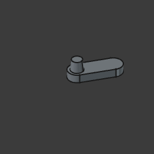

# OutpostTestFolder

<!-- GITPDM:PART-GLOSSARY:START -->
## Part Glossary

_Auto-generated by GitPDM from exported previews. Do not edit this section by hand; it is regenerated on export._

| Preview | Name | Path | Category | Bounding Box (mm) |
|---|---|---|---|---|
|  | [Important Part](previews/Important Part.stl) | `cad/Important Part.FCStd` | part | 2e+100 x 2e+100 x 2e+100 |
<!-- GITPDM:PART-GLOSSARY:END -->
